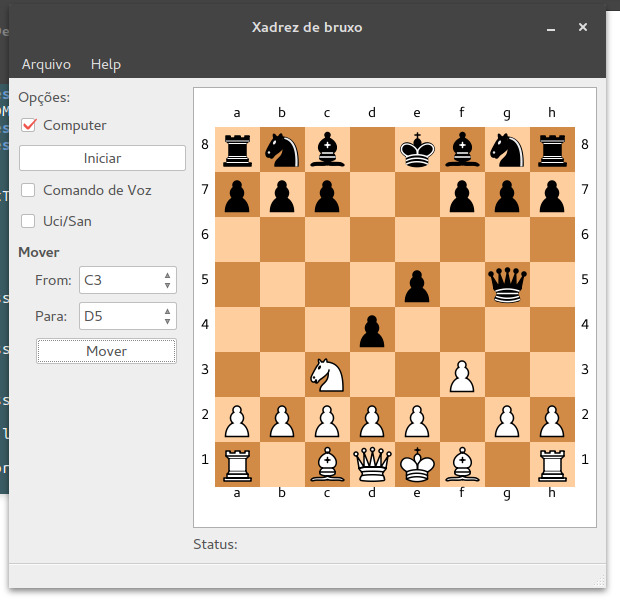

# Xadrez de bruxo
> Chess game controlled by voice commands and with physical pieces moving by itself.

Xadrez de bruxo surgiu em 2015, como trabalho final da disciplina de MTP,
durante a graduação em Engenharia Biomédica. O projeto visa controlar um
tabuleiro de xadrez real através de comandos de voz.



## Instalação
Faça o download do repositório.
Na pasta Software execute o arquivo ```app.py```:

```
python app.py
```

## In this repository

- Docs: Imagens, guias, referencias, codigos consultados.
- Software: Códigos da Interface.
- Firmware: Códigos do Arduino
- Unity: Simulação do funcionamento com o Unity.
- Hardware: Esquemas de montagem do Hardware

## Development setup

* [StockFish](https://stockfishchess.org/) - ChessEngine utilizada
* [Libraries](https://github.com/italogfernandes/libraries) - All the used custom libraries could be found here, if you didn't found someone please contact me.
* [Python2.7](https://www.python.org/downloads/) with the following modules installed:
    * [python-chess](https://pypi.python.org/pypi/python-chess): ``pip install python-chess[engine,gaviota]``
    * [PyQt4](https://sourceforge.net/projects/pyqt/): ``apt-get install python-qt4 pyqt4-dev-tools``
* Qt4Designer: ``apt-get install qt4-designer``    
* Unity 5.6.3xf1 (Preferred)- [Linux Instructions](https://forum.unity3d.com/threads/unity-on-linux-release-notes-and-known-issues.350256/) - [Windows and Mac](https://unity3d.com/).
* Arduino:
  *  [Platomformio](https://atom.io/packages/platomformio) - Atom integration with PlatformIO (for building arduino files,but arduino IDE can also be used.).
  * [Arduino IDE](www.arduino.cc) - If you prefer.

## More Info
Estes são os primeiros links que achei quando joguei a ideia no google:
* [Wizard's Chess](http://poe.olin.edu/poe2014/knights/): The same ideia of this project.
* [ChessInfo](https://pino.github.io/chessinfo.html): Responsive chessboard with integrated game logic and speech recognition.
* [JabberChess](https://cmusphinx.github.io/data/chess/ExtendedEssay.pdf): A Mobile Chess App Speech Recognizer for Visual and Motion Impaired Users
* [Voice Activated Chess Set](http://ideaexchange.uakron.edu/cgi/viewcontent.cgi?article=1356&context=honors_research_projects)
* [A nice video](https://www.youtube.com/watch?v=QEGJUZoUTCE): Voice Operated Chess Board
*  [Another Video](https://www.youtube.com/watch?v=dX37LFv8jWY): Wireless Arduino Powered Chess

## License

This project is licensed under the MIT License - see the [LICENSE.md](LICENSE.md) file for details

```
"THE BEERWARE LICENSE" (Revision 42):
Italo Fernandes wrote this code. As long as you retain this
notice, you can do whatever you want with this stuff. If we
meet someday, and you think this stuff is worth it, you can
buy me a beer in return.
```
## Authors

* **Italo Fernandes** - https://github.com/italogfernandes - italogsfernandes@gmail.com

See also the list of [contributors](https://github.com/italogfernandes/mtp-xadrez-de-bruxo/contributors) who participated in this project.

[https://github.com/italogfernandes/mtp-xadrez-de-bruxo](https://github.com/italogfernandes/mtp-xadrez-de-bruxo)
